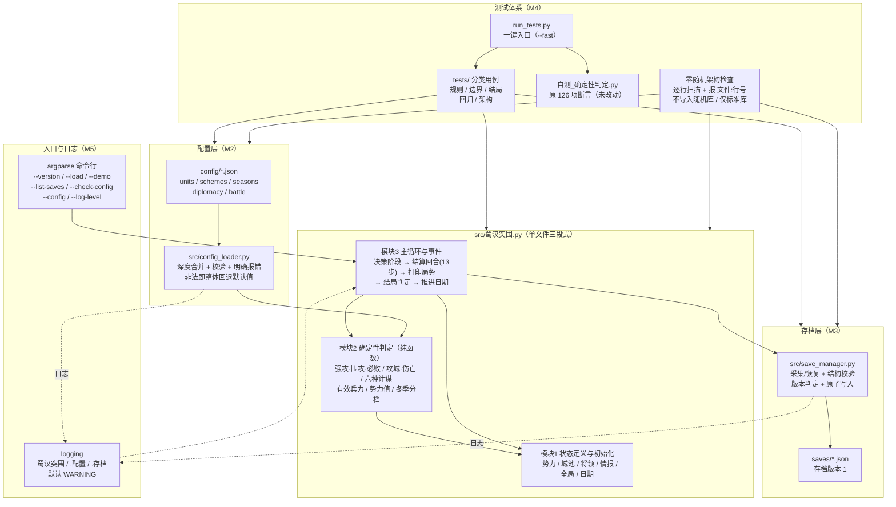
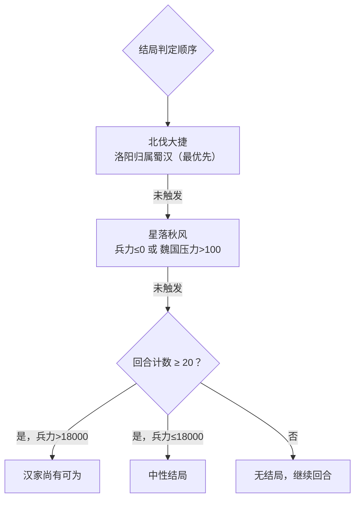

# 蜀汉突围 · 架构图

> 用途：配合 2~3 分钟讲解（配套讲稿见 [`../DEMO.md`](../DEMO.md)）。
> 图用 Mermaid 书写，GitHub / VS Code（Markdown 预览）可直接渲染；下面同时给出文字版，便于纯文本环境。

## 一、总体分层



**依赖方向是单向的**：`入口 → 主循环 → 判定 → 状态`；`配置层 / 存档层` 被主循环读取，但不反向依赖游戏逻辑；
`tests/` 只读生产代码、不修改它们。这保证了"改配置不必改代码、改代码不会动存档格式"。

## 二、一次回合的流水线（结算回合 13 步）


零随机的实现要点：**A 由玩家决定，B~N 全是确定性公式与阈值比较，P 是四条硬条件**——
同一输入必然得到同一结果，因此 `tests/` 里可以直接断言完整 20 回合对局的结局与终局数值。

## 三、四条结局路径



## 四、文字版（纯文本环境可用）

```text
[入口] argparse(--version/--load/--demo/--list-saves/--check-config/--config/--log-level) + logging
   │
   ├─→ [模块3 主循环]  决策阶段(玩家) → 结算回合(13步) → 打印局势(含态势图) → 结局判定 → 推进日期
   │        │                                   │                        │
   │        │                                   ├─→ [模块1 状态] 三势力/城池/将领/情报/全局/日期
   │        │                                   └─→ [模块2 判定] 军事阈值 · 计谋前置条件 · 有效兵力 · 势力值 · 冬季分档
   │        ├─→ [配置层] src/config_loader.py ← config/*.json（units/schemes/seasons/diplomacy/battle）
   │        └─→ [存档层] src/save_manager.py ←→ saves/*.json（存档版本 1，损坏检测 + 原子写入）
   │
   └─→ [测试体系] run_tests.py（--fast / 全量）
            ├─ tests/ 分类用例：规则 · 边界 · 结局 · 回归 · 架构 · 旧自测包装
            ├─ 自测_确定性判定.py：原 126 项断言（M4 起原样保留，由 test_legacy_suite 整体执行；仅补 src/ 路径引导）
            └─ 零随机架构检查：逐行扫描随机关键字（报 文件:行号）· 不导入随机库 · 仅标准库依赖 · 同输入结果稳定
```

## 五、讲解提示（每层一句话）

1. **入口层**：命令行参数与日志都是薄封装，游戏逻辑一行没改；不带参数仍然是原来的交互启动。
2. **模块2（判定）**：全部是纯函数——给条件、出结果，没有随机源，所以可以被穷举测试。
3. **模块1（状态）**：全是模块级字面量，没有类、没有数据库，改初始值就是改字面量。
4. **配置层**：把"数值"从"逻辑"里搬出来，并给非法配置一套可读报错 + 整体回退。
5. **存档层**：只做"全局命名空间 ↔ JSON"的搬运与校验，不碰判定逻辑；版本不兼容明确拒绝。
6. **测试体系**：一键跑通，分类清晰，旧断言不丢；零随机是架构级约束而不是口头承诺。
